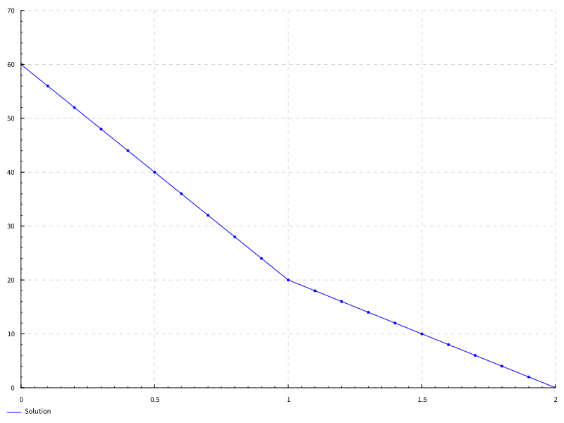

# Projekt końcowy przedmiotu "Równania różniczkowe"
Projekt stanowi prostą implementację metody elementów skończonych w Haskellu.


Analityczne rozwiązanie problemu jest w "pdfs/main.pdf".

Wykres zapisuje się do pliku "solution.svg". W projekcie jako przykład podany jest wykres dla n = 20.

## Build całego projektu
```
stack build
```

Dla n = 10
```
stack run
```

Dla dowolnego n
```
stack exec r-projekt-exe -- n
```
